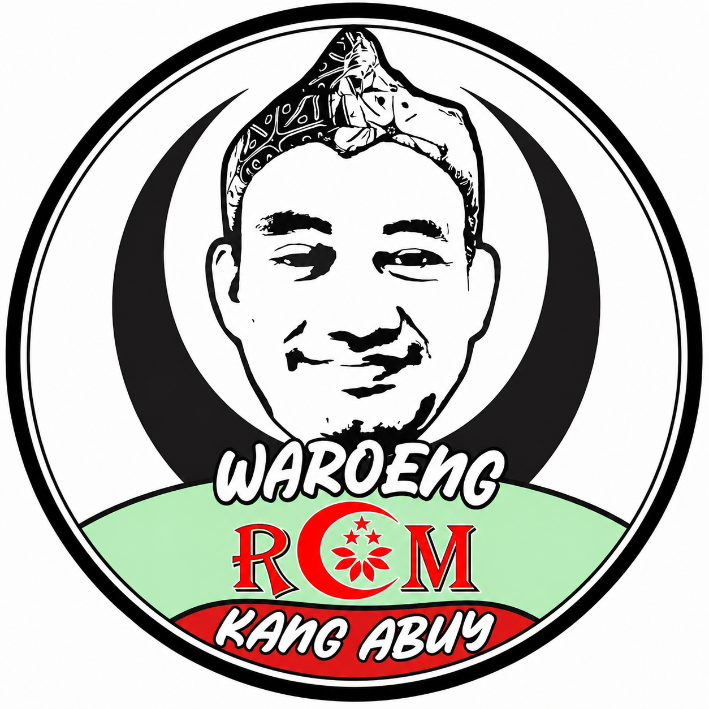

# 🍜 Waroeng RCM Kang Abuy

**Modern Restaurant Management System**

*"Makanan Enak, Harga Ekonomis, Solusi Ketika Laper & Mageer"*

[Demo](https://waroeng-rcm-kang-abuy.vercel.app) · [Report Bug](https://github.com/username/waroeng-rcm-kang-abuy/issues) · [Request Feature](https://github.com/username/waroeng-rcm-kang-abuy/issues)

---

## 📋 Daftar Isi

- [Tentang Project](#-tentang-project)
- [Fitur Utama](#-fitur-utama)
- [Tech Stack](#-tech-stack)
- [Arsitektur](#-arsitektur)
- [Prasyarat](#-prasyarat)
- [Instalasi](#-instalasi)
- [Konfigurasi](#-konfigurasi)
- [Struktur Project](#-struktur-project)
- [Database Schema](#-database-schema)
- [API & Realtime](#-api--realtime)
- [Deployment](#-deployment)
- [Panduan Pengguna](#-panduan-pengguna)
- [Role & Permission](#-role--permission)
- [Screenshots](#-screenshots)
- [Tim Pengembang](#-tim-pengembang)
- [Ucapan Terima Kasih](#-ucapan-terima-kasih)
- [Lisensi](#-lisensi)
- [Kontak](#-kontak)

---

## 📖 Tentang Project

**Waroeng RCM Kang Abuy** adalah sistem manajemen restoran modern yang dibangun menggunakan teknologi terkini. Sistem ini dirancang untuk membantu operasional restoran secara real-time, mulai dari pemesanan oleh pelanggan, pengelolaan pesanan oleh kasir, hingga analisis bisnis oleh admin.

Project ini merupakan hasil dari **Tugas Kerja Praktek (KP) Tahun 2026** yang dikembangkan sebagai solusi digital untuk UMKM restoran.

### 🎯 Tujuan

- Memudahkan pelanggan dalam memesan makanan (Dine-in & Takeaway)
- Membantu kasir mengelola pesanan dan pembayaran secara efisien
- Memberikan monitoring meja secara real-time
- Menyediakan laporan dan analitik bisnis yang komprehensif
- Mengoptimalkan operasional restoran
- Menerapkan teknologi modern dalam UMKM

### 🏢 Informasi Bisnis

| Detail | Informasi |
|--------|-----------|
| **Nama** | Waroeng RCM Kang Abuy |
| **Alamat** | Jl. Raya Cisauk Lapan Bunderan Avani No.21, Sampora, Kec. Cisauk, Kabupaten Tangerang, Banten 15345 |
| **Telepon** | 0821-1001-1010 |
| **WhatsApp** | 6282110011010 |
| **GoFood** | [Link GoFood](https://gofood.co.id/jakarta/restaurant/waroeng-rcm-kang-abuy-b9ada0f0-93a9-448a-997d-14a56bc904db) |

---

## ✨ Fitur Utama

### 🛒 **Customer (Pelanggan)**
- [x] Halaman Home dengan hero banner sinematik
- [x] Katalog menu dengan pencarian dan filter kategori
- [x] Keranjang belanja dengan persistence state
- [x] Checkout untuk Dine-in dan Takeaway
- [x] Pembayaran Cash dan QRIS
- [x] Tracking pesanan real-time
- [x] Scan QR Code meja untuk pemesanan
- [x] Redirect ke GoFood/GrabFood/ShopeeFood

### 💼 **Kasir (Point of Sale)**
- [x] Dashboard real-time (revenue, orders, tables)
- [x] POS system dengan menu grid
- [x] Quick checkout (cash & QRIS)
- [x] Monitoring meja real-time
- [x] Release & move table
- [x] Takeaway queue management
- [x] Payment verification
- [x] Closing kasir (cash verification)
- [x] Riwayat transaksi dengan export CSV
- [x] Notifikasi real-time dengan suara

### 📊 **Admin (Management)**
- [x] Dashboard analitik dengan charts
- [x] CRUD menu dengan upload gambar
- [x] CRUD kategori menu
- [x] CRUD promo & diskon
- [x] Manajemen meja & generate QR Code
- [x] Manajemen akun kasir
- [x] Monitoring semua pesanan
- [x] Laporan revenue & penjualan
- [x] Export laporan (CSV/Print)
- [x] Pengaturan website

### ⚡ **Realtime Features**
- [x] Update order tanpa refresh
- [x] Monitoring meja live
- [x] Notifikasi pesanan baru
- [x] Dashboard statistics auto-update
- [x] Takeaway queue real-time
- [x] Payment status sync
- [x] Table status changes

---

## 🛠 Tech Stack

### Frontend
| Teknologi | Versi | Kegunaan |
|-----------|-------|----------|
| **React** | 18.2 | UI Framework |
| **Vite** | 5.0 | Build Tool |
| **TailwindCSS** | 3.4 | Styling |
| **Framer Motion** | 10.18 | Animasi |
| **React Router DOM** | 6.21 | Routing |
| **Zustand** | 4.4 | State Management |
| **TanStack Query** | 5.17 | Data Fetching |
| **Recharts** | 2.10 | Charts & Analytics |
| **Lucide React** | 0.303 | Icons |
| **React QR Code** | 2.0 | QR Code Generator |
| **React Hot Toast** | 2.4 | Notifications |
| **date-fns** | 3.2 | Date Formatting |
| **clsx** | 2.1 | Conditional Classes |

### Backend
| Teknologi | Kegunaan |
|-----------|----------|
| **Supabase** | Backend as a Service |
| **PostgreSQL** | Database |
| **Supabase Auth** | Authentication |
| **Supabase Realtime** | Real-time subscriptions |
| **Supabase Storage** | File storage (images) |
| **Row Level Security** | Data security |

### Deployment
| Platform | Kegunaan |
|----------|----------|
| **Vercel** | Hosting (recommended) |
| **Netlify** | Alternative hosting |
| **Docker** | Containerization (optional) |

---

## 🏗 Arsitektur
